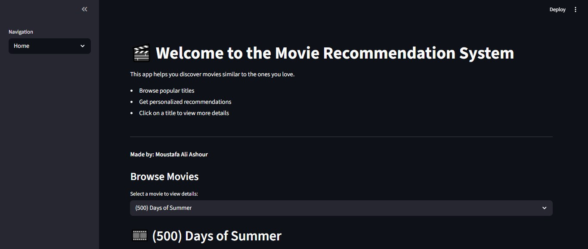

# 🎬 Movie Recommendation System

A **content-based movie recommender system** built using **TF-IDF vectorization** and **Streamlit** for an interactive web app.

It suggests movies similar to the one selected by the user, based on metadata such as genres, cast, keywords, and descriptions.

---

## 🚀 Demo

---

## 📌 Features

- 🔍 Recommend movies based on content similarity  
- 🧠 Uses TF-IDF and cosine similarity on `tags`  
- 🎥 Displays movie poster, rating, and overview  
- ⚡ Built with an intuitive and responsive Streamlit interface  

---

## 🧠 Tech Stack

- Python 3  
- Streamlit  
- scikit-learn  
- Pandas  
- Pillow  

---
## 📊 Dataset Requirements

Your `movies.csv` file should contain the following columns:

| Column         | Description                                |
|----------------|--------------------------------------------|
| `title`        | Movie title                                |
| `tags`         | Combined text (genres, overview, etc.)     |
| `poster_path`  | Relative path from TMDB poster API         |
| `overview`     | Short movie summary                        |
| `vote_average` | Average user rating                        |

You can build `tags` by combining fields like genre, cast, overview, and keywords.

---

## 🛠 Setup Instructions

### 1. Clone the repository

git clone https://github.com/MoustafaAliAshour/Movie-Recommendation-System.git
cd Movie-Recommendation-System

### 2. Install dependencies

pip install -r requirements.txt

### 3. Prepare the pickled files

Make sure movies.csv is ready, then run:
python create_pickle_files.py

### 4. Launch the Streamlit app

streamlit run movie_recommendation_app.py
✅ Example Usage
Select a movie from the dropdown

Click "Show Recommendation"

Get top 9 similar movies with posters, ratings, and overviews!

## 📄 License
This project is licensed under the MIT License.

## 💡 Credits
Developed with ❤️ using Streamlit and scikit-learn.
Inspired by how platforms like Netflix and Prime Video recommend movies.

## 📬 Contact
For questions or contributions, open an issue or contact: es-moustafa.aly2027@alexu.edu.eg
